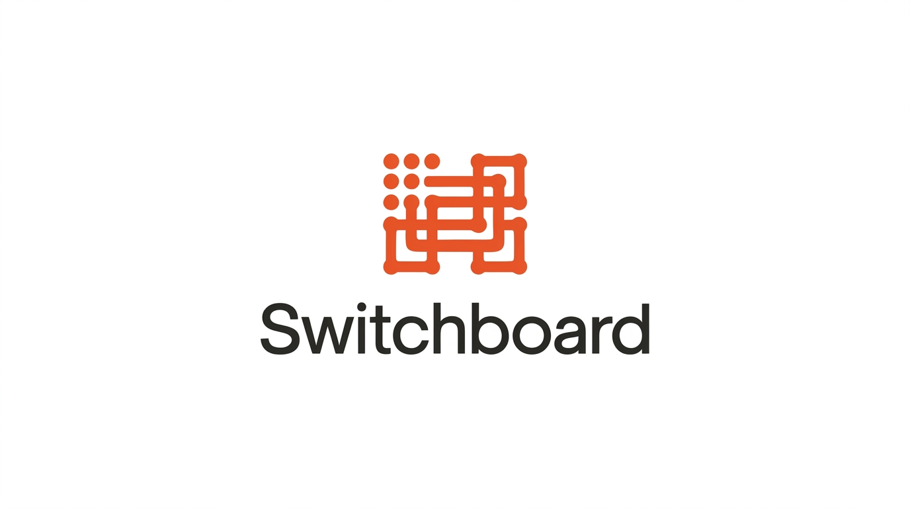

<p align="center">
  
</p>

# Switchboard

A five-stage data pipeline for NYC 311 service requests: ingestion, validation, ML enrichment, serving, and observability. Built end to end in Python over roughly 3.9 million records spanning a full year.

The name comes from the enrichment stage: like a telephone switchboard routing a call to the right destination, Switchboard predicts which city agency responds to each complaint from the complaint text alone.

## Pipeline

```
NYC Open Data API
      |
      v
[1] Ingestion        monthly windowed pulls, offset pagination, append-only raw layer
      |
      v
[2] Validation       two-tier quality policy, normalization, per-run quality report
      |
      v
[3] Enrichment       agency prediction (TF-IDF + logistic regression), temporal eval
      |
      v
[4] Serving          DuckDB database, versioned prediction table, SQL query surface
      |
      v
[5] Observability    freshness, volume, quality time series, category drift detection
```

## Design principles

**The raw layer is append-only and immutable.** Ingestion lands API responses untouched under timestamped filenames. No stage ever modifies raw data, so every downstream step is re-runnable from source and every processed row has lineage back to the exact API response it came from.

**Derived data never overwrites source data.** Normalized values live in `*_norm` columns beside the originals. Model predictions live in their own table, tagged with the model file that produced them, joined to the validated data at query time. Retraining rebuilds one small table and destroys nothing.

**Quality issues are counted, not hidden.** Hard failures (missing or duplicate `unique_key`, missing or unparseable `created_date`) are dropped
with counts reported. Soft failures (sentinel boroughs, missing coordinates, temporal anomalies) are flagged in boolean columns and retained, because dropping imperfect rows silently biases the dataset. Every run emits a JSON quality report.

**Evaluation is temporal, not shuffled.** The enrichment model trains on the first eleven months and is tested on the most recent two, mirroring deployment. A random split would leak future information into training and
overstate performance.

**Drift alerts require two thresholds.** A complaint type is flagged only if its share moved at least 1 percentage point (absolute) and at least 25% of its baseline share (relative). Absolute-only misses explosions in small categories; relative-only amplifies noise in tiny ones.

## Selected findings

- 3,901,970 rows validated with zero hard failures; cross-file duplicate detection doubled as empirical proof the pagination delivered every row exactly once
- 77,618 rows (2%) missing coordinates, retained and flagged rather than dropped to avoid selection bias; 592 complaints closed before they were created
- Agency prediction baseline: 99.6% accuracy, 0.982 macro F1 on a two-month temporal holdout. The gap is concentrated in DHS (0.68 recall), traced to genuine label ambiguity: near-identical complaints are routed to either DHS or NYPD in the real system
- First monitoring run caught NYC's seasons: heating complaints collapsed from 9.9% to 1.2% of volume, snow complaints vanished to zero, and illegal fireworks spiked 26x around July 4, caught specifically by the relative threshold
- The quality time series surfaced an unprompted anomaly: missing-descriptor rate at 2.5x baseline in the trailing 30 days

## Stack

Python, requests, pandas, pyarrow, scikit-learn, DuckDB, python-dotenv.

## Setup

Requires Python 3.10 or newer.

```bash
python -m venv .venv
source .venv/bin/activate
pip install -r requirements.txt
cp .env.example .env   # optional: add a Socrata app token for higher rate limits
```

## Running the pipeline

Each stage is a script at the repo root, run in order:

```bash
python pull_year.py       # 1. pull the trailing year (resumable, idempotent)
python run_validation.py  # 2. validate, write clean Parquet + quality report
python run_enrichment.py  # 3. train and evaluate the agency model
python build_db.py        # 4. build the DuckDB serving database
python run_monitor.py     # 5. run observability checks + drift report
```

Query the result:

```bash
python query.py                                           # canned demos
python query.py "SELECT count(*) FROM requests_enriched"  # arbitrary SQL
```

## Data source

311 Service Requests from 2020 to Present, NYC Open Data, dataset `erm2-nwe9`, via the Socrata SODA API. Read-only.